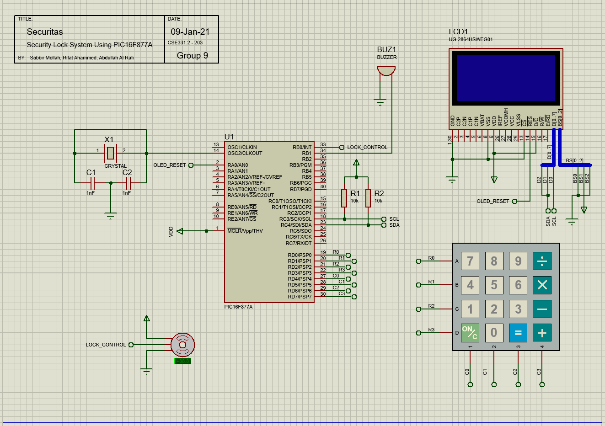

# Securitas
## Security Lock System Using PIC Microcontroller
***
This is a project made for CSE331 course at North South University.

## Objective
The objective section and further documentations and findings will be updated in the next commits.

## Update
This is the initial stage of the project. It is still very unstable and incomplete.

## Usage

1. Open the [simulation](simulation.pdsprj) file in Proteus.
2. Open the [code](securitas-src/Securitas.c) file in MikroC
3. Build the code.
4. Burn it in the chip in Proteus.

## Schematic Diagram
Here is the simulaiton diagram made in [Proteus](https://www.labcenter.com/).

## Authors
[Sabbir Mollah](https://github.com/sabbirmollah),
[Abdullah Al Rafi](https://github.com/alrafiabdullah/),
[Rifat Ahammed](https://github.com/rifatahammed)